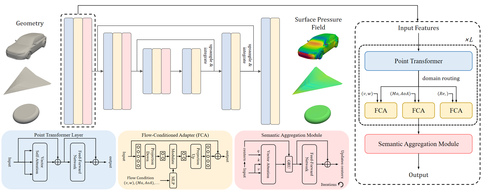

# UniField: Joint Multi-Domain Training for Universal Surface Pressure Modeling

<p align="center">
  
</p>

> This repository is a sub-project of [the ScienceOne(S1) project](https://scienceone.cn/).

> **UniField** is a universal sureface pressure field modeling framework that learns shared aerodynamic representations across heterogeneous domains — including cars, trains, aircraft, and general shapes — via **joint multi-domain training**.  
> It integrates a *domain-agnostic geometric backbone* with *domain-specific Flow-Conditioned Adapters*, achieving cross-domain generalization.

[[Paper]](https://arxiv.org/abs/xxxx.xxxxx)

---

## 🧭 Overview

Traditional CFD simulations for aerodynamic analysis are computationally expensive and domain-specific.  
**UniField** alleviates this limitation by **jointly training on multiple aerodynamic subfields**, enabling the model to learn *universal surface pressure representations* that transfer across different flow regimes.

Key features:
- **Unified Point Transformer backbone** for geometry encoding  
- **Parallel Flow-Conditioned Adapters (FCA)** for domain-specific flow conditioning  
- **Scalable architectures** (250M–2B parameters) for universal field representation  
- **State-of-the-art results** on [DrivAerNet++](https://github.com/Mohamedelrefaie/DrivAerNet) benchmark  

---

## 📦 Dataset

UniField leverages two public CFD datasets for training and evaluation.

### **DrivAerNet++**

[paper link](https://arxiv.org/abs/2406.09624)

[download page](https://dataverse.harvard.edu/dataverse/DrivAerNet)

Refer to "DrivAerNet++: Pressure" in the download page for downloading surface pressure field data.

After download & extraction, the dataset should be organized in the following structure:

```bash
DrivAerNet++/
├── Pressure/
│ ├── E_S_WW_WM_001.vtk
│ ├── F_D_WM_WW_1022.vtk 
│ ├── E_S_WWC_WM_374.vtk
│ └── ...
```

### **FlowBench**

[paper link](https://arxiv.org/abs/2409.18032)

[download page](https://huggingface.co/datasets/BGLab/FlowBench/tree/main)

After download & extraction, the dataset should be organized in the following structure:

```bash
FlowBench/
├── LDC_NS_3D/
│ ├── LDC_3d_X.npz
│ ├── LDC_3d_Y.npz
│── trans.py # copy the "trans.py" file in this repository to the dataset directory
```

run
```bash
cd /path/to/dataset/directory
python trans.py
```
for extracting surface pressure from volume data.

## 🚀 Usage

### Environment

| Dependency | Version |
|-------------|----------|
| Python      | 3.12 |
| PyTorch     | 2.6.0 + cu124 |
| numpy       | 2.2.3 | 
| pyvista     | 0.45.2 | 
| CUDA GPU    | NVIDIA H100|

You can create the environment as:
```bash
conda create -n unifield python=3.12
conda activate unifield
pip install torch==2.6.0+cu124 torchvision torchaudio --index-url https://download.pytorch.org/whl/cu124
````

---


### Training

For training UniField-2B on DrivAerNet++ and FlowBench, run
```bash
python train_UniField.py \
--drivaernet --drivaernet_root /path/to/DrivAerNet++/Pressure \
--flowbench --flowbench_root /path/to/FlowBench/LDC_NS_3D/point_cloud/ \
--modelscale 2b
```
Refer to the argparse in train_UniField.py for detailed settings.
train_AdaField.py can be run in similar way for training model on single datasets.

---

### Testing

For testing UniField-2B on DrivAerNet++ with 32768 points, run
```bash
python test.py --modeltype UniField --modelscale 2b \
--checkpoint_path /path/to/checkpoint --points 32768 --model_points 8192
```

Evaluation results (MSE, MAE, RelL2, RelL1) will be shown in the command line.

---

## 🧩 Checkpoints

| Model Scale   | Parameters |  Baidu Netdisk Download                          |
| ------------- | ---------- |  --------------------------------- |
| UniField-250M | 250M       |  [Download](https://pan.baidu.com/s/1kYOlVPIEz_Vnyhb7bRhklw?pwd=sylx) |
| UniField-1B   | 1B         |  [Download](https://pan.baidu.com/s/1wGF8tZ2wXQXm9FC9ElH2Gg?pwd=sylx) |
| UniField-2B   | 2B         |  [Download](https://pan.baidu.com/s/18B_HWEmZUJXVxxOM5E8Gjg?pwd=sylx) |


---

## 📚 Citation

If you find this work useful, please consider citing:

```bibtex
******
```

---

## 📬 Contact

For questions or collaborations, please contact:
**Junhong Zou** – [zoujunhong2022@ia.ac.cn](mailto:zoujunhong2022@ia.ac.cn)


---

## 🙏 Acknowledgment

This work was supported by the **PanShi Projec (ScienceOne(S1))**.
We welcome other researchers to explore and utilize the [**ScienceOne Platform**](https://scienceone.cn/) for accelerating AI-driven scientific discovery.